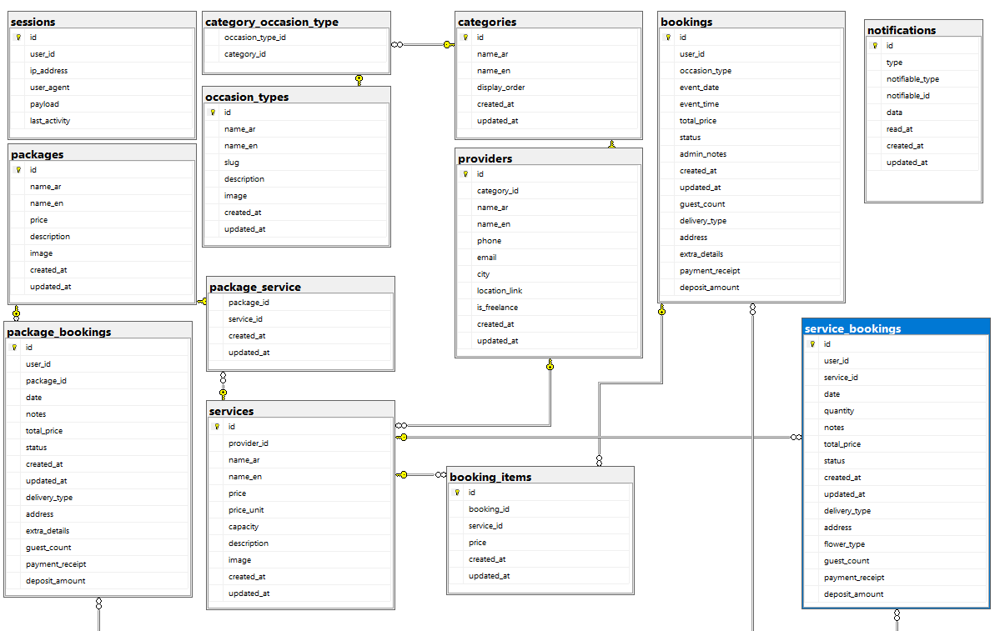
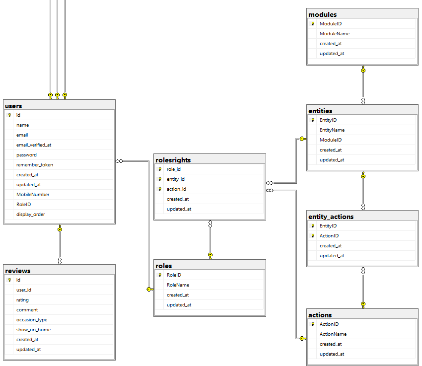
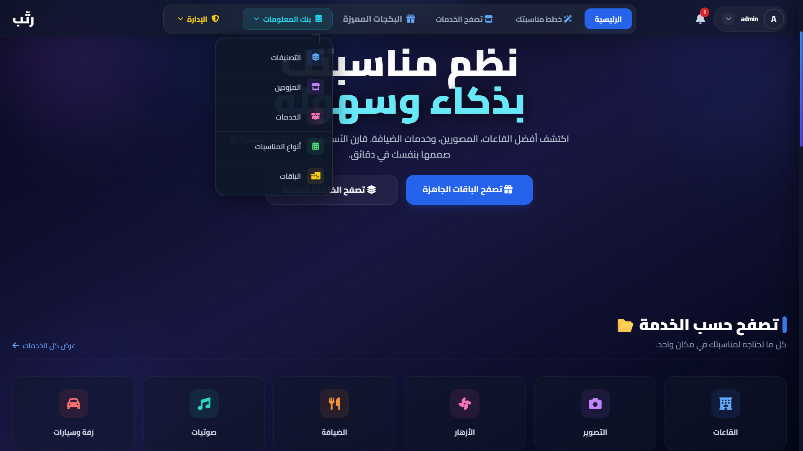
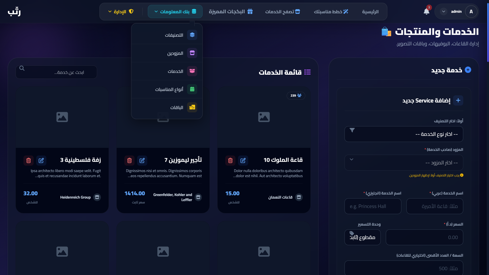
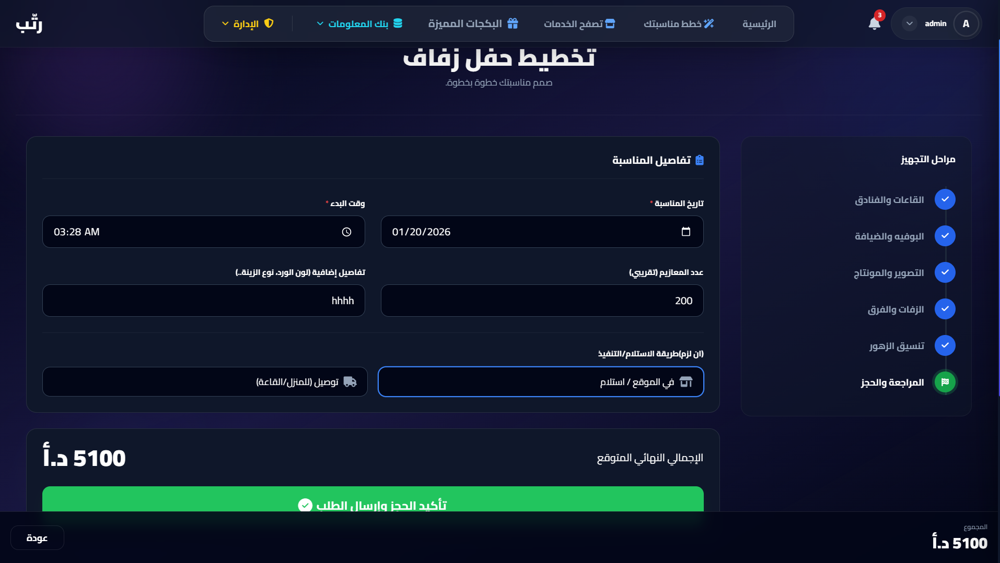
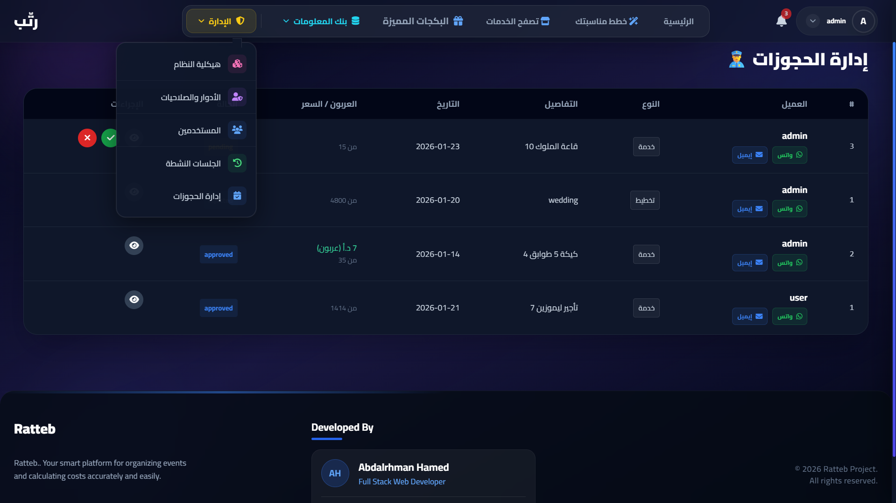

  

<h1 align="center">Ratteb (رتّب) - Event Planning Platform</h1>

  <strong>Your smart platform for organizing events, calculating costs, and booking services with ease.</strong>

  
  
  
  

 

## 📋 About The Project

**Ratteb** is a sophisticated event planning system designed to bridge the gap between event service providers and customers. It solves the chaos of organizing weddings, parties, or corporate events by providing a unified **"One-Stop Shop"** experience.

The system relies on a powerful **DataBank** architecture where admins configure the core data (Providers, Services, Packages), allowing users to mix and match these services through a dynamic **Wizard** interface.

---

## 🔄 How It Works (System Workflow)

1.  **The Guest Experience:**
    * A visitor lands on the site and browses available services.
    * They enter the **Planning Wizard** to build a custom event (selecting Venue, Food, Decoration, etc.).
    * **Smart State Persistence:** If the user isn't logged in, the system **saves their draft locally**. They are redirected to Login/Register and then immediately returned to their draft without losing any data.

2.  **The Booking Process:**
    * Once confirmed, the booking is stored in **SQL Server**.
    * Real-time notifications are sent to the Administration.

3.  **Admin Control:**
    * Admins review the incoming booking requests via the **Admin Dashboard**.
    * The system allows Accepting/Rejecting bookings based on availability.
    * Admins manage the entire system structure via the **DataBank Module**.

---

## 🗄️ Database Design (ERD)

The system is built on a robust relational database schema designed for scalability and data integrity.

  

  

---

## 📸 System Gallery

  

  

  

  

  

---

## ✨ Key Features

### 🚀 Advanced User Features:
* **Interactive Planning Wizard:** A step-by-step guide to customize events.
* **Draft Persistence:** Uses `LocalStorage` + `Laravel Logic` to keep user selections safe across sessions.
* **Real-Time Cost Calculation:** Instant price updates as services are added/removed.
* **Responsive UI:** Mobile-first design using Tailwind CSS.

### 🛡️ Admin & Security (Back-Office):
* **Role-Based Access Control (RBAC):** dynamic permission system (Permissions, Roles, Routes protection).
* **DataBank Architecture:** A centralized module to manage:
    * **Occasion Types:** (Weddings, Graduations, Meetings...).
    * **Categories:** (Venues, Catering, Flowers...).
    * **Service Providers:** (Vendor profiles and details).
    * **Services:** (Individual items with pricing and capacity).
* **System Monitoring:** View active sessions and system health.

---

## 🛠️ Tech Stack

* **Backend:** PHP 8.x, Laravel 10.x
* **Database:** Microsoft SQL Server (SQLSRV)
* **Frontend:** Blade, Tailwind CSS, Alpine.js
* **Version Control:** Git & GitHub

---

## 👨‍💻 Developed By

**Abdalrhman Hamed** - *Full Stack Web Developer*

Connect with me:
* 
* 
* 

---

  © 2026 Ratteb Project. All rights reserved.

